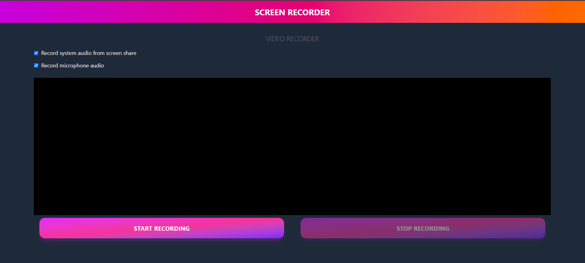

# Screen Recorder

A modern browser-based screen recorder built with Vue 3 and Vite. This app lets you capture your screen, optionally include system audio and microphone input, preview the recording, and download the final video.

## Live Demo

https://mrpaul98.github.io/ScreenRecorder/

## App Preview

Below is a screenshot of the app UI. To show the real interface add a screenshot file at `public/image.png` (recommended). The PNG illustration is kept as a fallback.



## Features

- Record your screen with one click
- Optionally capture system audio from the screen share
- Optionally record microphone audio
- Preview the recorded video before downloading
- Seek through the recording and download it in the best supported format

## Tech Stack

- Vue 3
- Vite
- Tailwind CSS
- MediaRecorder API
- Pinia

## Prerequisites

Before running the project locally, make sure you have:

- Node.js 20 or later
- A modern browser such as Chrome or Edge

## Getting Started

Install dependencies:

```bash
npm install
```

Start the development server:

```bash
npm run dev
```

Then open the local URL shown in the terminal, usually:

```text
http://localhost:5173/screen-recorder/
```

## Build for Production

Create a production build:

```bash
npm run build
```

Preview the build locally:

```bash
npm run preview
```

## Usage

1. Open the app in your browser.
2. Choose whether to include system audio and/or microphone audio.
3. Click Start Recording.
4. Select the screen or window you want to capture when prompted.
5. Click Stop Recording when you are done.
6. Preview the recording and click Download Video.

## Notes

- Browser permissions are required for screen capture and microphone access.
- Recording support may vary slightly by browser and operating system.
- Chromium-based browsers are recommended for the best experience.

## Deployment

This project is deployed to GitHub Pages through GitHub Actions.
